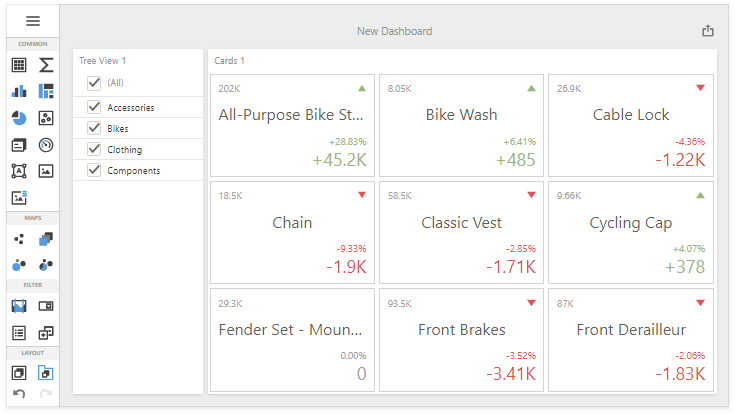

<!-- default badges list -->

<!-- default badges end -->
*Files to look at*:

* [Default.aspx](./CS/WebFormsDashboardConfigurator/Default.aspx)
* [Default.aspx.cs](./CS/WebFormsDashboardConfigurator/Default.aspx.cs)
* [Global.asax.cs](./CS/WebFormsDashboardConfigurator/Global.asax.cs)

# ASPxDashboard - How to Set Up a Server Part with DashboardConfigurator
<!-- run online -->
**[[Run Online]](https://codecentral.devexpress.com/170876401/)**
<!-- run online end -->

This example demonstrates how to set up ASPxDashboard with the DashboardConfigurator settings.

Set the [ASPxDashboard.UseDashboardConfigurator](http://docs.devexpress.com/Dashboard/DevExpress.DashboardWeb.ASPxDashboard.UseDashboardConfigurator) property to **true** and use the [DashboardConfigurator](http://docs.devexpress.com/Dashboard/DevExpress.DashboardWeb.DashboardConfigurator) to process data-related operations and handle data-related events (set the dashboard/data source storage, specify a connection provider, etc).

### See Also

* [Web Forms Dashboard - Server-Side API Overview](http://docs.devexpress.com/Dashboard/12139/)
